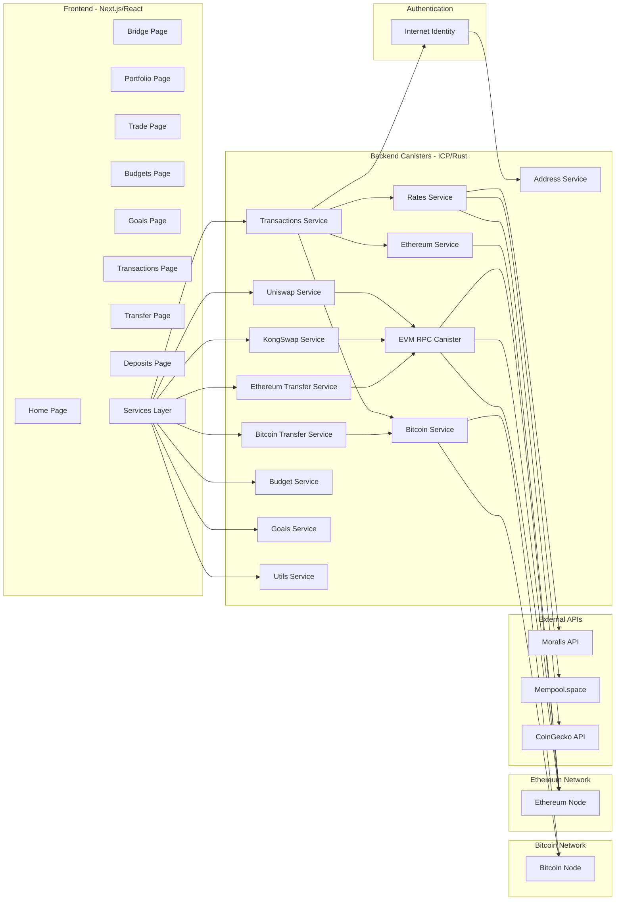
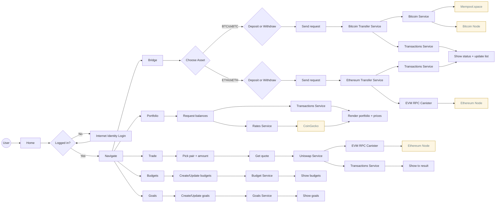

# 🔄 FinTrack Protocol - Cross-Chain DeFi Super App

[](https://opensource.org/licenses/MIT)
[](https://internetcomputer.org/)
[](https://nextjs.org/)
[](https://rust-lang.org/)
[](https://ic0.app/)

> **🏆 Hackathon Submission**: A comprehensive cross-chain DeFi platform that leverages Internet Computer's unique capabilities to create a unified financial ecosystem bridging Bitcoin, Ethereum, and ICP.

## 🌟 Project Overview

**FinTrack Protocol** is a revolutionary cross-chain DeFi super app built on Internet Computer that addresses the fragmentation problem in decentralized finance. While most DeFi platforms are limited to single chains, FinTrack creates a unified ecosystem where users can seamlessly manage Bitcoin, Ethereum, and ICP assets while accessing advanced portfolio management, budgeting tools, and cross-chain DeFi protocols.

### 🎯 Unique Value Proposition

- **Cross-Chain Unification**: First DeFi platform to truly unify Bitcoin, Ethereum, and ICP ecosystems
- **Native Asset Support**: Direct integration with native BTC/ETH networks via HTTP outcalls
- **Personal Finance Integration**: Combines DeFi with traditional personal finance management
- **ICP-Native Architecture**: Leverages Internet Computer's unique features for superior UX

## 🚀 Key Features

### 🔗 Cross-Chain Bridge Operations
- **ckBTC Integration**: Full Bitcoin support through Internet Computer's native Bitcoin integration
- **ckETH Integration**: Complete Ethereum support with smart contract integration
- **Native Asset Transfers**: Direct BTC/ETH transfers on native blockchains via HTTP outcalls
- **Real-time Transaction Tracking**: Monitor transactions across all chains 
- **Fee Optimization**: Dynamic fee calculation using Bitcoin network data

### 💼 Advanced Portfolio Management
- **Multi-Chain Balance Tracking**: Real-time balances across BTC, ETH, ckBTC, ckETH, and ICP
- **Portfolio Analytics**: Visual representation of cross-chain asset distribution with performance metrics
- **Transaction History**: Comprehensive logs with native asset support and cross-chain transaction correlation
- **Performance Tracking**: Monitor portfolio performance across different blockchains

### 🎯 Personal Finance Integration
- **Budgeting Tools**: Set monthly budgets, With Vesting Linear
- **Financial Goals**: Define investment targets, savings goals, and financial milestones with progress tracking


### 🔄 DeFi Ecosystem Integration
- **Uniswap Integration**: Direct access to Ethereum's largest DEX via ECDSA signing
- **Cross-Chain Swapping**: Swap between ckAssets (ckBTC ↔ ckETH) with optimized routing with KongSwap


### 🔐 Security & Authentication
- **Internet Identity**: Decentralized authentication via Internet Computer
- **ECDSA Signing**: Secure transaction signing via Internet Computer management canister
- **Multi-Chain Address Derivation**: Deterministic address generation from Principal

## 🏗️ Architecture Diagram



### 🔄 System Flow

1. **User Access**: User navigates through different frontend pages
2. **Authentication**: Internet Identity provides decentralized authentication
3. **API Integration**: Frontend makes calls to backend canister services
4. **External Data**: Backend fetches data from Moralis, Mempool.space, and CoinGecko
5. **Cross-Chain Operations**: Backend handles bridging via ckBTC/ckETH canisters
6. **Native Blockchain**: Direct interaction with Bitcoin and Ethereum networks
7. **Data Persistence**: All user data stored securely on Internet Computer

### 👣 User Flow Diagram



## 🏗️ Architecture

### 🏗️ Architecture Description – Fintrack_new

1. Overview

FinTrack Protocol is a Cross-Chain DeFi Super App built on the Internet Computer (ICP).
The application enables users to:

- View and manage multi-chain portfolios (Bitcoin, Ethereum, and ERC-20 tokens).
- Transfer assets across chains through ckBTC, ckETH, and the EVM RPC service.
- Manage personal finance with budgeting and financial goals.
- Swap tokens with Uniswap integration.

The architecture is designed to be modular and service-oriented, where each canister is responsible for a specific domain and can evolve independently.

2. System Components

🔹 Frontend (Next.js + React)

Pages / Modules:

- Bridge → cross-chain bridge (BTC ↔ ckBTC, ETH ↔ ckETH)
- Home → landing page and main navigation
- Portfolio → display user’s total assets.
- Trade → token swaps via Uniswap.
- Budgets → personal budget management.
- Goals → financial target management.
- Transactions → transaction history.
- Transfer / Deposit → cross-chain sending & receiving of assets.
- Services Layer → abstraction layer for communication with backend canisters.
- Authentication → Internet Identity integration for login and mapping principal → account.

🔹 Backend (ICP Canisters, Rust)

The backend is composed of multiple canister services, each serving a dedicated purpose:

- BTC Service
  - Manages Bitcoin deposits & transfers via ckBTC.
  - Queries Bitcoin network data (via mempool.space API).
- ETH Service
  - Integration with ckETH.
  - ERC-20 token transfers and balances.
- Uniswap Service
  - Executes swaps via Uniswap Universal Router.
  - Supports both quoting and swap execution.
- Transactions Service
  - Records and tracks user transactions.
  - Maintains cross-chain transaction history.
- Rates Service
  - Provides real-time asset pricing (BTC, ETH, ERC-20).
  - Fetches data from external APIs (e.g., Coingecko).
- Address Service
  - Handles address derivation from user principals.
  - Supports ECDSA signing for external blockchain interactions.
- Budget Service
  - Manages user budgeting data.
  - Tracks expenses across categories.
- Goals Service
  - Tracks user-defined financial goals (e.g., saving 0.5 BTC).
  - Stores progress and completion status.
- Utils Service
  - Helper functions (value conversion, input validation, etc.).

3. External Integrations

Blockchains:

- Bitcoin (via ckBTC + mempool.space API).
- Ethereum (via ckETH, EVM_RPC canister, Uniswap).

APIs:

- Moralis → Fetch Address Transaction.
- Mempool.space → Fetch Address Transaction.

ICP Native Services:

- Internet Identity 2.0 for authentication.
- Threshold ECDSA signing for secure key management.
- Bitcoin Canister: Native Bitcoin integration for UTXO management and transaction signing
- HTTP Outcalls: Real-time data fetching from external APIs (Moralis, Mempool.space, Coingecko)


4. Data Flow (User Journey)

- User login → authenticated through Internet Identity → receives a unique principal.
- Portfolio view → frontend requests data from Rates Service + Transactions Service → displays balances & history.
- Swap trade → user specifies swap pair → frontend sends to Uniswap Service → fetch quote → transaction signed → submitted via Ethereum RPC.
- Deposit/Transfer → user initiates request → BTC/ETH Service processes transaction → executes via ckBTC/ckETH + external API → result returned to user.
- Budgeting & Goals → user stores and updates budgets/goals in Budget Service and Goals Service; data bound to the user’s principal.

7. Architectural Goals

- Scalability → modular services deployed as independent canisters.
- Security → authentication through Internet Identity + ECDSA key management.
- Cross-chain interoperability → Bitcoin, Ethereum, ERC-20, Uniswap.
- User-centric experience → portfolio, trading, and financial management combined in one app

### Backend (Internet Computer Canisters)
```
┌─────────────────────────────────────────────────────────────┐
│                    FinTrack Backend                         │
├─────────────────────────────────────────────────────────────┤
│  ┌─────────────┐ ┌─────────────┐ ┌─────────────┐           │
│  │   BTC       │ │    ETH      │ │ Transactions│           │
│  │   Service   │ │   Service   │ │   Service   │           │
│  └─────────────┘ └─────────────┘ └─────────────┘           │
│                                                             │
│  ┌─────────────┐ ┌─────────────┐ ┌─────────────┐           │
│  │  Uniswap    │ │   Budget    │ │    Goals    │           │
│  │   Service   │ │   Service   │ │   Service   │           │
│  └─────────────┘ └─────────────┘ └─────────────┘           │
│                                                             │
│  ┌─────────────┐ ┌─────────────┐ ┌─────────────┐           │
│  │    Rates    │ │   Address   │ │   Utils     │           │
│  │   Service   │ │   Service   │ │   Service   │           │
│  └─────────────┘ └─────────────┘ └─────────────┘           │
└─────────────────────────────────────────────────────────────┘
```

### Frontend (Next.js + React)
```
┌─────────────────────────────────────────────────────────────┐
│                    FinTrack Frontend                        │
├─────────────────────────────────────────────────────────────┤
│  ┌─────────────┐ ┌─────────────┐ ┌─────────────┐           │
│  │   Bridge    │ │  Portfolio  │ │    Trade    │           │
│  │    Page     │ │    Page     │ │    Page     │           │
│  └─────────────┘ └─────────────┘ └─────────────┘           │
│                                                             │
│  ┌─────────────┐ ┌─────────────┐ ┌─────────────┐           │
│  │  Budgets    │ │    Goals    │ │Transactions │           │
│  │    Page     │ │    Page     │ │    Page     │           │
│  └─────────────┘ └─────────────┘ └─────────────┘           │
│                                                             │
│  ┌─────────────┐ ┌─────────────┐ ┌─────────────┐           │
│  │  Transfer   │ │  Deposits   │ │  Services   │           │
│  │    Page     │ │    Page     │ │   Layer     │           │
│  └─────────────┘ └─────────────┘ └─────────────┘           │
└─────────────────────────────────────────────────────────────┘
```

## 🔧 ICP Features Used

### Core ICP Capabilities
- **HTTP Outcalls**: Real-time data fetching from external APIs (Moralis, Mempool.space)
- **Bitcoin API**: Native Bitcoin integration for UTXO management and transaction signing
- **ECDSA Signing**: Secure transaction signing for Ethereum and Bitcoin transactions
- **Stable Memory**: Persistent storage for transaction history and user data
- **Inter-Canister Calls**: Communication with ckBTC, ckETH, and other IC canisters
- **Internet Identity 2.0**: Update Internet Identity to 2.0

### Advanced Features
- **Principal-based Address Derivation**: Deterministic address generation across chains
- **Real-time Data Sync**: Live updates from external blockchain networks
- **Fee Optimization**: Dynamic fee calculation based on network conditions

## 💰 Revenue Model

### Current Status
**No Revenue Model Yet - Focus on User Adoption**

FinTrack Protocol is currently in the development and user acquisition phase. We prioritize building a solid user base and community over immediate monetization.

### Future Considerations
Once we have established a strong user base, we may consider:
- **Educational Content**: Tutorials and courses for blockchain beginners
- **Premium Features**: Advanced analytics and priority support

### User Adoption Strategy
**Target: Blockchain Beginners & Newcomers**

1. **Completely Free**: All features are free to encourage adoption
2. **Beginner-Friendly**: Simple interface designed for newcomers
3. **Educational Focus**: Built-in learning modules and tutorials

### Current Focus
- **Primary Goal**: User adoption and community building
- **Secondary Goal**: Platform stability and feature development
- **Long-term Vision**: Build a trusted platform for blockchain beginners

## 🛠️ Build & Deployment

### Prerequisites
- Node.js 23.5.0
- Rust 1.89.0
- DFX 0.28.0
- Git
- Bitcoin Core (for local Bitcoin node)

### Local Development Setup

1. **Clone the Repository**
```bash
git clone https://github.com/demigohu/Fintrack_new.git
cd Fintrack_new

# Switch to local development branch
git checkout local
```

2. **Install Bitcoin Core**
Download and install Bitcoin Core from [bitcoin.org](https://bitcoin.org/en/download)
```bash
# For Ubuntu/Debian
sudo apt update
sudo apt install bitcoin-core

# For macOS (using Homebrew)
brew install bitcoin

# For Windows
# Download from https://bitcoin.org/en/download
```

3. **Install Dependencies**
```bash
# Install backend dependencies
cd fintrack_backend
cargo build

# Install frontend dependencies
cd ../fintrack_frontend
npm install
```

4. **Setup Bitcoin Configuration**
Create `bitcoin.conf` file in project root:
```bash
# Create bitcoin.conf
cat > bitcoin.conf << EOF
regtest=1
server=1
rpcuser=bitcoin
rpcpassword=bitcoin
rpcport=18443
port=18444
rpcallowip=127.0.0.1
fallbackfee=0.00001
txindex=1
EOF
```

5. **Start Bitcoin Node**
```bash
# Start Bitcoin Core in regtest mode
bitcoind -conf=$(pwd)/bitcoin.conf -datadir=$(pwd)/bitcoin_data --port=18444
```

6. **Start Internet Computer Network**
```bash
# Start DFX replica with Bitcoin integration
dfx start --clean --enable-bitcoin --bitcoin-node 127.0.0.1:18444

# Deploy canisters locally
dfx deploy
```

7. **Setup EVM RPC API Keys**
```bash
# Set API keys for Ethereum networks (optional for local development)
dfx canister call evm_rpc updateApiKeys '(vec { record { 5 : nat64; opt "YOUR_API" } } )'
dfx canister call evm_rpc updateApiKeys '(vec { record { 9 : nat64; opt "YOUR_API" } } )'
```

8. **Start Frontend Development Server**
```bash
cd fintrack_frontend
npm run dev
```

9. **Access the Application**
After running `dfx deploy`, you'll see the generated canister IDs and URLs:
```
Deployed canisters.
URLs:
  Frontend canister via browser
    http://<frontend_canister_id>.127.0.0.1:4943/
  Backend canister via Candid interface:
    http://127.0.0.1:4943/?canisterId=<backend_canister_id>&id=<backend_canister_id>
```

**Access Points:**
- **Frontend**: http://<frontend_canister_id>.127.0.0.1:4943/
- **Backend Candid**: http://127.0.0.1:4943/?canisterId=<backend_canister_id>&id=<backend_canister_id>
- **Bitcoin RPC**: http://127.0.0.1:18443

**Note**: Replace `<frontend_canister_id>` and `<backend_canister_id>` with the actual canister IDs displayed after deployment.

### Production Deployment

1. **Deploy to Internet Computer Mainnet**
```bash
# Deploy all canisters defined in dfx.json to mainnet
dfx deploy --network ic

# This will automatically deploy:
# - fintrack_backend (Rust canister)
# - fintrack_frontend (assets canister)
# - evm_rpc (evm_rpc canister)
# - All remote canisters (ckBTC, ckETH, Internet Identity, etc.)
```

2. **Add Environment Configuration on next.config**
```bash
# Set production environment variables
export DFX_NETWORK=ic
export NEXT_PUBLIC_IC_HOST=https://ic0.app
export NEXT_PUBLIC_DFX_NETWORK=ic
```

## 🌐 Mainnet Deployment

### Canister IDs
- **FinTrack Backend**: `hchhn-yyaaa-aaaab-qb5ta-cai`
- **FinTrack Frontend**: `a4gq6-oaaaa-aaaab-qaa4q-cai`
- **EVM_RPC**: `giifx-2iaaa-aaaab-qb5ua-cai`

### External Canister Integrations
- **ckBTC Minter**: `ml52i-qqaaa-aaaar-qaaba-cai`
- **ckBTC Ledger**: `mxzaz-hqaaa-aaaar-qaada-cai`
- **ckBTC Index**: `mm444-5iaaa-aaaar-qaabq-cai`
- **ckETH Minter**: `jzenf-aiaaa-aaaar-qaa7q-cai`
- **ckETH Ledger**: `apia6-jaaaa-aaaar-qabma-cai`
- **ckETH Index**: `sh5u2-cqaaa-aaaar-qacna-cai`
- **Internet Identity**: `rdmx6-jaaaa-aaaaa-aaadq-cai`

### Live URLs
- **FinTrack_Frontend**: `https://hchhn-yyaaa-aaaab-qb5ta-cai.icp0.io/`
- **FinTrack_Backend**: `https://a4gq6-oaaaa-aaaab-qaa4q-cai.raw.icp0.io/?id=hlemr-oqaaa-aaaab-qb5sq-cai`

## 🎥 Demo Video

[](https://www.youtube.com/watch?v=VIDEO_ID)

*Watch our comprehensive demo showcasing cross-chain bridge operations, portfolio management, and personal finance features.*

## 🧪 Testing

### Current Testing Status
**Note**: Testing infrastructure is planned for future development. Currently, the application is manually tested through the live demo and user interface.

### Manual Testing
```bash
# Test backend functionality through Candid interface
# Access: http://127.0.0.1:4943/?canisterId=<backend_canister_id>&id=<backend_canister_id>

# Test frontend through browser
# Access: http://<frontend_canister_id>.127.0.0.1:4943/

# Test Bitcoin integration
# Use Bitcoin regtest commands to test BTC transactions
```

### Planned Testing (Future)
- **Unit Tests**: Backend Rust tests
- **Integration Tests**: Cross-chain transaction tests
- **PocketIC Tests**: Internet Computer integration tests
- **Frontend Tests**: React component tests

## 🚧 Challenges Faced

### Technical Challenges
1. **Uniswap Integration Complexity**: The most challenging part was implementing Uniswap integration with ECDSA signing
   - **Challenge**: Managing complex Ethereum transaction signing via Internet Computer's ECDSA
   - **Challenge**: Handling Uniswap V3 routing, slippage, and gas estimation
   - **Challenge**: Integrating multiple Uniswap contracts (Router, Quoter, Permit2)
   - **Challenge**: Managing nonce tracking and transaction queuing for Ethereum

2. **HTTP Outcall Cycle Management**: Optimizing cycles for external API calls
   - **Challenge**: Calculating precise cycle costs for Moralis API and Mempool.space
   - **Challenge**: Handling large response sizes (500KB+ for Bitcoin transactions)
   - **Challenge**: Implementing proper error handling for cycle exhaustion

3. **Cross-Chain Transaction Parsing**: Converting different blockchain transaction formats
   - **Challenge**: Parsing Bitcoin UTXO transactions from Mempool.space API
   - **Challenge**: Handling Ethereum transaction logs and event parsing
   - **Challenge**: Normalizing transaction data across different blockchains

4. **Real-time Data Synchronization**: Managing live updates without excessive polling
   - **Challenge**: Balancing real-time updates with performance
   - **Challenge**: Implementing efficient caching strategies
   - **Challenge**: Handling network timeouts and API rate limits

### Solutions Implemented
1. **Uniswap Integration**: 
   - Implemented comprehensive ECDSA signing with proper nonce management
   - Created modular transaction building system for different Uniswap operations
   - Added proper error handling and retry mechanisms for failed transactions

2. **Dynamic Cycle Calculation**: 
   - Implemented official IC cycles cost formulas with 10-15% buffers
   - Separated API calls to avoid cycle limit issues
   - Added response size limits and pagination

3. **Transaction Normalization**: 
   - Created unified transaction format across all blockchains
   - Implemented proper filtering for bridge-related transactions
   - Added comprehensive transaction status tracking

4. **Performance Optimization**: 
   - Used stable memory for transaction caching
   - Implemented batch operations for multiple API calls
   - Added loading states and error boundaries in frontend

## 🔮 Future Plans

### Next Round
- **Solana Integration**: Add support for Solana blockchain and SPL tokens
- **Additional DeFi Protocols**: Integrate more DeFi protocols like Aave, Compound, and Curve

### Post Hackathon
- **Cross-Chain Governance**: Decentralized governance for protocol upgrades
- **Additional Chains**: Support for Polygon, Avalanche, and other major blockchains
- **Institutional Features**: Enterprise-grade tools for institutions and businesses


### Ecosystem Expansion
- **Developer SDK**: Tools for third-party developers to integrate FinTrack features
- **Educational Platform**: DeFi education and tutorials for users
- **Research & Development**: Advanced DeFi protocol research and optimization

## 👥 Team

- **Lead Developer**: Demigohu - Full-stack developer 
- **Frontend Developer**: Kopsus - React/Next.js 
- **Backend Developer**: Engkoh - Rust/ICP 
- **UI/UX Designer**: Doyok - DeFi UX 

## 📄 License

This project is licensed under the MIT License - see the [LICENSE](LICENSE) file for details.

## 🤝 Contributing

We welcome contributions! Please see our [Contributing Guidelines](CONTRIBUTING.md) for details.

## 📞 Contact

- **Email**: tgraji.k@gmail.com
- **Twitter**: [@FinTrackProtocol](https://twitter.com/FinTrackProtocol)
- **GitHub**: [FinTrack Protocol](https://github.com/demigohu/)

---

**Built with ❤️ on Internet Computer**

*FinTrack Protocol - Bridging the Future of Cross-Chain Finance*